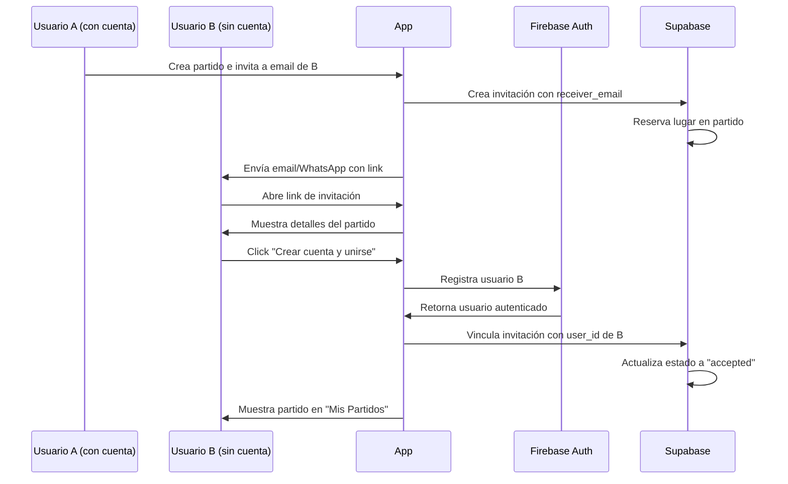
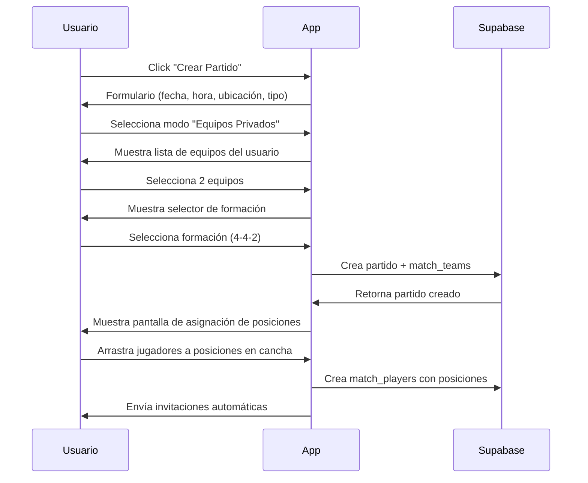
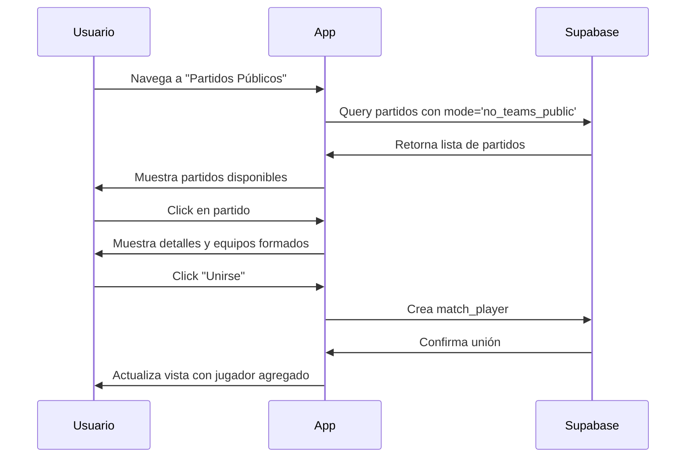

# ⚽ Futbolito - Organizador de Partidos de Fútbol

> Aplicación móvil para organizar partidos de fútbol, gestionar equipos e invitar amigos de forma sencilla y moderna.

---

## 📋 Tabla de Contenidos

- [Visión del Proyecto](#-visión-del-proyecto)
- [Características Principales](#-características-principales)
- [Stack Tecnológico](#-stack-tecnológico)
- [Arquitectura](#️-arquitectura)
- [Estructura del Proyecto](#-estructura-del-proyecto)
- [Modelo de Datos](#-modelo-de-datos)
- [Flujos de Usuario](#-flujos-de-usuario)
- [Roadmap](#-roadmap)
- [Instalación y Configuración](#-instalación-y-configuración)

---

## 🎯 Visión del Proyecto

**Futbolito** es una aplicación móvil que facilita la organización de partidos de fútbol entre amigos, equipos y comunidades. La app permite crear partidos, gestionar equipos con rosters permanentes, invitar jugadores a través de múltiples canales y mantener un seguimiento completo de la actividad futbolística.

### Objetivos Principales

- **Simplicidad**: Crear y unirse a partidos debe ser rápido e intuitivo
- **Flexibilidad**: Soportar diferentes modos de partido (privado, público, con/sin equipos)
- **Social**: Sistema de invitaciones robusto que funciona incluso sin cuenta previa
- **Escalabilidad**: Arquitectura preparada para torneos y funcionalidades avanzadas

---

## ✨ Características Principales

### MVP (Versión 1.0)

#### 🔐 Autenticación y Perfil

- Login con Firebase Auth (Google, Email)
- Perfil de usuario con foto de Google/Gmail
- Estadísticas básicas (partidos jugados, victorias, etc.)

#### 👥 Sistema de Equipos

- Crear equipos con nombre, escudo y roster de jugadores
- Equipos reutilizables en múltiples partidos
- Administrador de equipo (creador)
- Roster permanente que puede modificarse
- Un jugador puede pertenecer a varios equipos

#### ⚽ Sistema de Partidos

- Crear partidos con fecha, hora y ubicación
- Tipos de partido personalizables (5vs5, 7vs7, 11vs11, etc.)
- **4 Modos de Partido:**
  1. **Equipos Privados**: El organizador invita equipos específicos
  2. **Sin Equipos - Join Libre**: Jugadores individuales se unen, los equipos se forman al inicio
  3. **Privado Sin Equipos**: Como el anterior pero con código de invitación
  4. **Equipos Públicos**: Equipos completos pueden unirse al partido público

#### 📨 Sistema de Invitaciones

- Invitaciones con 3 estados: `enviado`, `pendiente`, `aceptado`
- Invitar por email/WhatsApp sin necesidad de cuenta previa
- La invitación **reserva el lugar temporalmente**
- Cuando el usuario crea cuenta, las invitaciones se vinculan automáticamente
- Sin expiración de invitaciones
- Invitaciones para:
  - Partidos (asignando posición)
  - Equipos (para unirse al roster)
  - Amigos (sistema social)

#### 🏟️ Gestión de Posiciones

- Asignar posiciones a jugadores en cada partido
- Límite de titulares configurable
- Suplentes ilimitados
- Visualización tipo "cancha de FIFA" con formación táctica
- Formaciones predefinidas (4-4-2, 4-3-3, 3-5-2, etc.)
- Posiciones configurables por partido (no fijas por jugador)

#### 🔔 Notificaciones

- Push notifications para:
  - Nuevas invitaciones
  - Recordatorios de partido (1 hora antes)
  - Cambios en el partido

#### ✏️ Edición y Gestión

- El administrador puede editar/cancelar partidos
- Cambios de último momento (mover jugadores, agregar suplentes)
- Partidos públicos vs privados

---

### Funcionalidades Futuras (Post-MVP)

#### 📸 Perfiles Avanzados

- Subir foto de perfil personalizada
- Posición preferida/frecuente
- Estadísticas detalladas por temporada

#### 📊 Sistema de Puntuación

- Al finalizar el partido, jugadores pueden calificar a:
  - Otros jugadores
  - Equipos
- Registro de estadísticas detalladas:
  - Goles
  - Asistencias
  - Tarjetas amarillas/rojas
  - Minutos jugados

#### 📜 Historial y Estadísticas

- Historial completo de partidos
- Estadísticas globales por jugador y equipo
- Gráficos de rendimiento

#### 🏆 Torneos

- Crear torneos con múltiples partidos
- Tabla de posiciones
- Sistema de eliminatorias
- Clasificación automática

#### 💬 Chat (Nice to Have)

- Chat por partido
- Chat por equipo
- Mensajería directa

---

## 🛠 Stack Tecnológico

### Frontend

- **Flutter** 3.x - Framework principal
- **Dart** 3.x - Lenguaje de programación
- **Riverpod** 2.x - Gestión de estado
- **Go Router** - Navegación declarativa
- **Freezed** - Modelos inmutables y code generation
- **GetIt** - Inyección de dependencias
- **DIO** - Cliente HTTP
- **Supabase Flutter** - Cliente Supabase
- **Firebase SDK** - Firebase Auth y FCM

### Backend

- **Firebase Auth** - Autenticación de usuarios
- **Supabase Database** - Base de datos PostgreSQL
- **Supabase Realtime** - Actualizaciones en tiempo real
- **Supabase Storage** - Almacenamiento de archivos (futuro)
- **Firebase Cloud Messaging (FCM)** - Push notifications

### Herramientas de Desarrollo

- **flutter_riverpod** - Provider de Riverpod
- **go_router** - Routing
- **freezed** + **freezed_annotation** - Generación de código
- **json_serializable** - Serialización JSON
- **supabase_flutter** - Cliente de Supabase
- **firebase_auth** - Cliente de Firebase Auth
- **firebase_messaging** - Notificaciones push

---

## 🏗️ Arquitectura

### Clean Architecture + Feature-First

El proyecto sigue los principios de **Clean Architecture** con una organización **Feature-First**, lo que permite escalabilidad y mantenibilidad a largo plazo.

```
lib/
├── main.dart                    # Entry point
├── core/                        # Funcionalidades compartidas
│   ├── di/                      # Dependency Injection (GetIt)
│   ├── navigator/               # Configuración de Go Router
│   ├── constants/               # Constantes globales
│   ├── theme/                   # Tema y estilos
│   ├── utils/                   # Utilidades
│   └── errors/                  # Manejo de errores
├── common/                      # Widgets y lógica compartida
│   ├── widgets/                 # Widgets reutilizables
│   ├── providers/               # Providers globales
│   └── extensions/              # Extensions de Dart
└── features/                    # Features de la app
    ├── auth/                    # Autenticación
    │   ├── data/
    │   │   ├── datasources/     # Firebase Auth datasource
    │   │   ├── repositories/    # Implementación de repositorios
    │   │   └── models/          # Modelos de datos
    │   ├── domain/
    │   │   ├── entities/        # Entidades del dominio
    │   │   ├── repositories/    # Interfaces de repositorios
    │   │   └── usecases/        # Casos de uso
    │   └── presentation/
    │       ├── providers/       # Riverpod providers
    │       ├── screens/         # Pantallas
    │       └── widgets/         # Widgets específicos
    ├── profile/                 # Perfil de usuario
    ├── teams/                   # Gestión de equipos
    ├── matches/                 # Gestión de partidos
    ├── invitations/             # Sistema de invitaciones
    ├── notifications/           # Notificaciones
    └── home/                    # Pantalla principal
```

### Capas de Clean Architecture

#### 1. **Data Layer** (Capa de Datos)

- **DataSources**: Conexión directa con APIs externas (Supabase, Firebase)
- **Models**: Representación de datos con serialización JSON
- **Repositories Implementation**: Implementación concreta de los repositorios

#### 2. **Domain Layer** (Capa de Dominio)

- **Entities**: Objetos de negocio puros (sin dependencias externas)
- **Repositories Interfaces**: Contratos que define cómo obtener datos
- **UseCases**: Lógica de negocio específica (ej: `CreateMatchUseCase`)

#### 3. **Presentation Layer** (Capa de Presentación)

- **Providers**: Estado de la aplicación con Riverpod
- **Screens**: Páginas de la aplicación
- **Widgets**: Componentes UI reutilizables

### Principios SOLID Aplicados

- **Single Responsibility**: Cada clase tiene una única responsabilidad
- **Open/Closed**: Abierto a extensión, cerrado a modificación
- **Liskov Substitution**: Las abstracciones son intercambiables
- **Interface Segregation**: Interfaces específicas por feature
- **Dependency Inversion**: Dependemos de abstracciones, no de implementaciones

---

## 📂 Estructura del Proyecto

### Organización por Feature

Cada feature sigue esta estructura:

```
feature_name/
├── data/
│   ├── datasources/
│   │   └── feature_remote_datasource.dart
│   ├── models/
│   │   └── feature_model.dart
│   └── repositories/
│       └── feature_repository_impl.dart
├── domain/
│   ├── entities/
│   │   └── feature_entity.dart
│   ├── repositories/
│   │   └── feature_repository.dart
│   └── usecases/
│       ├── create_feature.dart
│       ├── get_feature.dart
│       └── update_feature.dart
└── presentation/
    ├── providers/
    │   └── feature_provider.dart
    ├── screens/
    │   ├── feature_list_screen.dart
    │   └── feature_detail_screen.dart
    └── widgets/
        └── feature_card.dart
```

### Ejemplo: Feature "Matches"

```
matches/
├── data/
│   ├── datasources/
│   │   └── matches_remote_datasource.dart      # Supabase queries
│   ├── models/
│   │   ├── match_model.dart                    # JSON serialization
│   │   ├── match_type_model.dart
│   │   └── formation_model.dart
│   └── repositories/
│       └── matches_repository_impl.dart
├── domain/
│   ├── entities/
│   │   ├── match.dart                          # Entidad pura
│   │   ├── match_type.dart
│   │   ├── match_mode.dart                     # Enum: 4 modos
│   │   └── formation.dart
│   ├── repositories/
│   │   └── matches_repository.dart             # Interface
│   └── usecases/
│       ├── create_match.dart
│       ├── get_matches.dart
│       ├── update_match.dart
│       ├── delete_match.dart
│       └── join_match.dart
└── presentation/
    ├── providers/
    │   ├── matches_provider.dart               # Lista de partidos
    │   ├── match_detail_provider.dart
    │   └── create_match_provider.dart
    ├── screens/
    │   ├── matches_list_screen.dart
    │   ├── match_detail_screen.dart
    │   ├── create_match_screen.dart
    │   └── formation_selector_screen.dart      # Cancha tipo FIFA
    └── widgets/
        ├── match_card.dart
        ├── match_type_selector.dart
        ├── formation_field.dart                # Widget de cancha
        └── player_position_draggable.dart
```

---

## 🗄️ Modelo de Datos

### Supabase Schema

#### Tabla: `users`

```sql
CREATE TABLE users (
  id UUID PRIMARY KEY DEFAULT uuid_generate_v4(),
  firebase_uid TEXT UNIQUE NOT NULL,
  email TEXT UNIQUE NOT NULL,
  display_name TEXT,
  photo_url TEXT,
  created_at TIMESTAMP WITH TIME ZONE DEFAULT NOW(),
  updated_at TIMESTAMP WITH TIME ZONE DEFAULT NOW(),

  -- Estadísticas básicas
  matches_played INT DEFAULT 0,
  matches_won INT DEFAULT 0,
  matches_lost INT DEFAULT 0,
  matches_drawn INT DEFAULT 0
);
```

#### Tabla: `teams`

```sql
CREATE TABLE teams (
  id UUID PRIMARY KEY DEFAULT uuid_generate_v4(),
  name TEXT NOT NULL,
  shield_url TEXT,
  admin_id UUID REFERENCES users(id) ON DELETE CASCADE,
  created_at TIMESTAMP WITH TIME ZONE DEFAULT NOW(),
  updated_at TIMESTAMP WITH TIME ZONE DEFAULT NOW(),

  -- Estadísticas
  matches_played INT DEFAULT 0,
  matches_won INT DEFAULT 0,
  matches_lost INT DEFAULT 0,
  matches_drawn INT DEFAULT 0
);
```

#### Tabla: `team_members`

```sql
CREATE TABLE team_members (
  id UUID PRIMARY KEY DEFAULT uuid_generate_v4(),
  team_id UUID REFERENCES teams(id) ON DELETE CASCADE,
  user_id UUID REFERENCES users(id) ON DELETE CASCADE,
  joined_at TIMESTAMP WITH TIME ZONE DEFAULT NOW(),

  UNIQUE(team_id, user_id)
);
```

#### Tabla: `match_types`

```sql
CREATE TABLE match_types (
  id UUID PRIMARY KEY DEFAULT uuid_generate_v4(),
  name TEXT NOT NULL,
  players_per_team INT NOT NULL,
  created_by UUID REFERENCES users(id),
  is_default BOOLEAN DEFAULT false,
  created_at TIMESTAMP WITH TIME ZONE DEFAULT NOW()
);

-- Tipos predefinidos: 5vs5, 7vs7, 11vs11, etc.
```

#### Tabla: `formations`

```sql
CREATE TABLE formations (
  id UUID PRIMARY KEY DEFAULT uuid_generate_v4(),
  name TEXT NOT NULL,                    -- "4-4-2", "4-3-3", etc.
  match_type_id UUID REFERENCES match_types(id),
  positions JSONB NOT NULL,              -- Array de posiciones con coordenadas
  is_default BOOLEAN DEFAULT false
);

-- Ejemplo de positions JSONB:
-- [
--   {"position": "GK", "x": 0.5, "y": 0.1},
--   {"position": "LB", "x": 0.2, "y": 0.3},
--   ...
-- ]
```

#### Tabla: `matches`

```sql
CREATE TABLE matches (
  id UUID PRIMARY KEY DEFAULT uuid_generate_v4(),
  admin_id UUID REFERENCES users(id) ON DELETE CASCADE,
  match_type_id UUID REFERENCES match_types(id),

  -- Modo de partido
  mode TEXT NOT NULL CHECK (mode IN ('teams_private', 'no_teams_public', 'no_teams_private', 'teams_public')),

  -- Información básica
  title TEXT NOT NULL,
  description TEXT,
  date TIMESTAMP WITH TIME ZONE NOT NULL,
  location TEXT NOT NULL,
  location_lat DECIMAL(10, 8),
  location_lng DECIMAL(11, 8),

  -- Configuración
  max_starters_per_team INT NOT NULL,
  invitation_code TEXT UNIQUE,           -- Para partidos privados

  -- Estado
  status TEXT DEFAULT 'scheduled' CHECK (status IN ('scheduled', 'in_progress', 'finished', 'cancelled')),

  created_at TIMESTAMP WITH TIME ZONE DEFAULT NOW(),
  updated_at TIMESTAMP WITH TIME ZONE DEFAULT NOW()
);
```

#### Tabla: `match_teams`

```sql
CREATE TABLE match_teams (
  id UUID PRIMARY KEY DEFAULT uuid_generate_v4(),
  match_id UUID REFERENCES matches(id) ON DELETE CASCADE,
  team_id UUID REFERENCES teams(id) ON DELETE SET NULL,  -- Puede ser NULL si no hay equipo
  team_number INT NOT NULL CHECK (team_number IN (1, 2)),
  formation_id UUID REFERENCES formations(id),

  UNIQUE(match_id, team_number)
);
```

#### Tabla: `match_players`

```sql
CREATE TABLE match_players (
  id UUID PRIMARY KEY DEFAULT uuid_generate_v4(),
  match_id UUID REFERENCES matches(id) ON DELETE CASCADE,
  match_team_id UUID REFERENCES match_teams(id) ON DELETE CASCADE,
  user_id UUID REFERENCES users(id) ON DELETE CASCADE,

  -- Posición en el partido
  position TEXT,                         -- "GK", "LB", "CB", "CM", "ST", etc.
  is_starter BOOLEAN DEFAULT false,

  -- Estado
  status TEXT DEFAULT 'pending' CHECK (status IN ('pending', 'confirmed', 'declined')),

  joined_at TIMESTAMP WITH TIME ZONE DEFAULT NOW(),

  UNIQUE(match_id, user_id)
);
```

#### Tabla: `invitations`

```sql
CREATE TABLE invitations (
  id UUID PRIMARY KEY DEFAULT uuid_generate_v4(),
  type TEXT NOT NULL CHECK (type IN ('match', 'team', 'friend')),

  -- Remitente
  sender_id UUID REFERENCES users(id) ON DELETE CASCADE,

  -- Destinatario (puede ser email sin cuenta)
  receiver_id UUID REFERENCES users(id) ON DELETE CASCADE,
  receiver_email TEXT NOT NULL,
  receiver_phone TEXT,

  -- Referencias según tipo
  match_id UUID REFERENCES matches(id) ON DELETE CASCADE,
  team_id UUID REFERENCES teams(id) ON DELETE CASCADE,
  assigned_position TEXT,                -- Si es invitación a partido

  -- Estado
  status TEXT DEFAULT 'sent' CHECK (status IN ('sent', 'pending', 'accepted', 'declined')),

  -- Mensaje personalizado
  message TEXT,

  created_at TIMESTAMP WITH TIME ZONE DEFAULT NOW(),
  responded_at TIMESTAMP WITH TIME ZONE
);
```

#### Tabla: `friendships`

```sql
CREATE TABLE friendships (
  id UUID PRIMARY KEY DEFAULT uuid_generate_v4(),
  user_id UUID REFERENCES users(id) ON DELETE CASCADE,
  friend_id UUID REFERENCES users(id) ON DELETE CASCADE,
  status TEXT DEFAULT 'pending' CHECK (status IN ('pending', 'accepted')),
  created_at TIMESTAMP WITH TIME ZONE DEFAULT NOW(),

  UNIQUE(user_id, friend_id)
);
```

---

## 🔄 Flujos de Usuario

### 1. Flujo de Registro e Invitación Sin Cuenta



### 2. Flujo de Creación de Partido con Equipos



### 3. Flujo de Unirse a Partido Público



---

## 🗺️ Roadmap

### Fase 1: Fundamentos (4-6 semanas)

- [ ] Configuración inicial de proyecto
- [ ] Integración Firebase Auth + Supabase
- [ ] Schema de base de datos
- [ ] Sistema de autenticación completo
- [ ] Perfil de usuario básico
- [ ] Tema oscuro/claro

### Fase 2: Equipos (3-4 semanas)

- [ ] CRUD de equipos
- [ ] Agregar/remover miembros
- [ ] Pantalla de detalle de equipo
- [ ] Lista de equipos del usuario

### Fase 3: Partidos (6-8 semanas)

- [ ] CRUD de partidos
- [ ] Implementación de 4 modos de partido
- [ ] Selector de tipo de partido
- [ ] Selector de formación táctica
- [ ] Widget de cancha tipo FIFA
- [ ] Asignación de posiciones drag & drop
- [ ] Sistema de titulares/suplentes
- [ ] Pantalla de detalle de partido

### Fase 4: Invitaciones (4-5 semanas)

- [ ] Sistema de invitaciones a partidos
- [ ] Invitaciones a equipos
- [ ] Invitaciones de amistad
- [ ] Deep linking para invitaciones
- [ ] Manejo de invitaciones sin cuenta previa
- [ ] Pantalla de invitaciones pendientes

### Fase 5: Notificaciones (2-3 semanas)

- [ ] Integración FCM
- [ ] Notificaciones de invitación
- [ ] Recordatorios de partido
- [ ] Notificaciones de cambios

### Fase 6: Polish y Testing (3-4 semanas)

- [ ] Testing unitario
- [ ] Testing de integración
- [ ] UI/UX refinement
- [ ] Optimización de rendimiento
- [ ] Preparación para producción

**TOTAL MVP: 22-30 semanas (~6-8 meses)**

---

### Post-MVP (Futuro)

#### Fase 7: Estadísticas y Puntuación

- [ ] Sistema de puntuación post-partido
- [ ] Registro de goles, asistencias
- [ ] Estadísticas detalladas por jugador
- [ ] Estadísticas por equipo
- [ ] Gráficos de rendimiento

#### Fase 8: Historial

- [ ] Historial de partidos
- [ ] Filtros y búsqueda
- [ ] Exportar estadísticas

#### Fase 9: Torneos

- [ ] CRUD de torneos
- [ ] Tabla de posiciones
- [ ] Sistema de eliminatorias
- [ ] Clasificación automática

#### Fase 10: Social

- [ ] Chat por partido
- [ ] Chat por equipo
- [ ] Mensajería directa
- [ ] Feed de actividad

#### Fase 11: Multimedia

- [ ] Subir fotos personalizadas
- [ ] Galería de fotos de partidos
- [ ] Compartir en redes sociales

---

## 🚀 Instalación y Configuración

### Prerrequisitos

- Flutter SDK 3.x
- Dart SDK 3.x
- Android Studio / Xcode
- Cuenta de Firebase
- Cuenta de Supabase

### Instalación

```bash
# Clonar repositorio
git clone https://github.com/tu-usuario/futbolito.git
cd futbolito

# Instalar dependencias
flutter pub get

# Generar código (Freezed, Json Serializable)
flutter pub run build_runner build --delete-conflicting-outputs
```

### Configuración Firebase

1. Crear proyecto en [Firebase Console](https://console.firebase.google.com/)
2. Agregar app Android/iOS
3. Descargar `google-services.json` (Android) y `GoogleService-Info.plist` (iOS)
4. Colocar archivos en las carpetas correspondientes
5. Habilitar autenticación con Google y Email

### Configuración Supabase

1. Crear proyecto en [Supabase](https://supabase.com/)
2. Ejecutar el SQL schema (ver sección [Modelo de Datos](#-modelo-de-datos))
3. Obtener `URL` y `anon key` del proyecto
4. Crear archivo `.env`:

```env
SUPABASE_URL=your_supabase_url
SUPABASE_ANON_KEY=your_supabase_anon_key
```

### Configuración FCM (Firebase Cloud Messaging)

1. En Firebase Console, ir a Project Settings > Cloud Messaging
2. Habilitar Cloud Messaging API
3. Configurar certificados para iOS (APNs)

### Ejecutar App

```bash
# Modo desarrollo
flutter run

# Modo release
flutter run --release
```

---

## 🧪 Testing

```bash
# Tests unitarios
flutter test

# Tests de integración
flutter test integration_test/

# Cobertura de código
flutter test --coverage
genhtml coverage/lcov.info -o coverage/html
```

---

## 📝 Convenciones de Código

- **Nomenclatura**: camelCase para variables, PascalCase para clases
- **Archivos**: snake_case
- **Imports**: Ordenar por: Dart SDK > Flutter > Packages > Relative
- **Commits**: Conventional Commits (feat:, fix:, docs:, refactor:, test:)
- **Branches**: feature/, bugfix/, hotfix/, release/

---

## 📄 Licencia

Este proyecto es privado y de uso interno.

---

## 👥 Equipo

- **Desarrollador Principal**: Joel Sartori

---

## 📞 Contacto

Para preguntas o sugerencias, contactar a través de [tu email/github].

---

**¡Vamos Futbolito! ⚽🔥**
